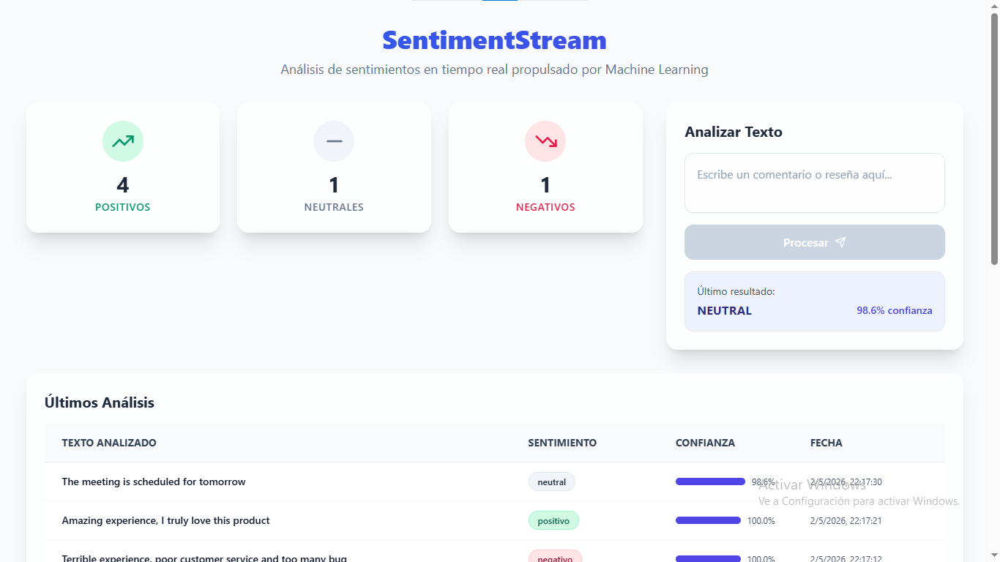
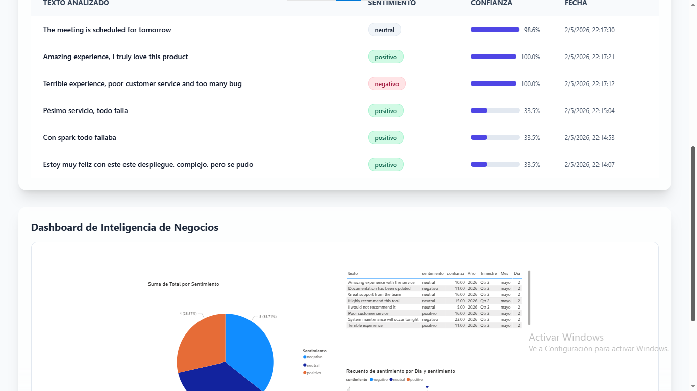

# SentimentStream — Sistema Distribuido de Análisis de Sentimientos

## Acceso al sistema

- **Frontend (Vercel):** https://iue-big-data-feeling.vercel.app/
- **API (Render):** https://iue-big-data-feeling.onrender.com
- **Power BI Dashboard:** https://app.powerbi.com/view?r=eyJrIjoiNzI2MzQ2MDItMDNmZS00YTAyLWJjZDYtNTc0Yjg4OGVhZWRiIiwidCI6IjAwNTRhYWU4LWU0YTUtNDRlYy1iZDg5LWJlNDkyYmU5NGU1NyIsImMiOjR9

## Descripción

SentimentStream es una plataforma distribuida que clasifica en tiempo real los sentimientos (positivo, negativo, neutral) de textos ingresados por usuarios. Resuelve el problema de latencia en modelos Big Data usando una arquitectura dual. Combina Apache Spark para el entrenamiento masivo asíncrono y una API de Flask con Scikit-learn para inferencias ultrarrápidas. Los resultados se visualizan en un dashboard de Power BI embebido en una interfaz moderna de React.

## Arquitectura

El sistema implementa una Arquitectura Lambda simplificada para garantizar rendimiento y escalabilidad:

- **Capa Batch:** Apache Spark se encarga del procesamiento masivo y entrenamiento distribuido de los modelos.
- **Capa Speed:** Flask y Scikit-learn exponen el modelo entrenado para inferencias inmediatas en tiempo real.
- **Base de Datos:** MongoDB Atlas persiste todas las predicciones y estadísticas.
- **Frontend:** React (SPA) consume la API para interactuar con el usuario.
- **Business Intelligence:** Power BI consume los datos para generar reportes gerenciales.

**Diagrama de flujo de datos:**
React → API Flask → MongoDB → Power BI

## Tecnologías usadas

- PySpark
- Scikit-learn
- Flask
- MongoDB Atlas
- React + Vite + Tailwind
- Power BI
- Docker
- Jenkins
- Render
- Vercel

## Ejecución local

### Backend
```bash
cd api
pip install -r requirements.txt
python app.py
```

### Frontend
```bash
cd apps/frontend
npm install
npm run dev
```

## Endpoints principales

| Endpoint | Descripción |
|---|---|
| `GET /health` | Verifica la disponibilidad de la API y el estado del servidor. |
| `GET /api/stats` | Obtiene el conteo total agrupado de sentimientos (positivo, negativo, neutral). |
| `GET /api/sentiments` | Devuelve los últimos registros procesados para poblar la tabla visual. |
| `POST /api/predict` | Recibe un texto, ejecuta el modelo de Machine Learning y retorna la predicción. |

## Dashboard

El sistema integra un dashboard analítico avanzado alojado en Microsoft Power BI. Este tablero está embebido directamente en la aplicación web mediante un iframe seguro.

Exhibe métricas clave como la distribución histórica de sentimientos, la evolución temporal de las percepciones de los usuarios y una matriz detallada con las predicciones.

## Flujo del sistema

1. El usuario ingresa un texto a través de la aplicación React.
2. La API Flask recibe el texto y usa Scikit-learn para predecir el sentimiento.
3. El resultado y la confianza estadística se guardan inmediatamente en MongoDB.
4. El Frontend se actualiza asíncronamente mostrando el nuevo registro y estadísticas.
5. Power BI refleja las métricas actualizadas para la toma de decisiones.

## CI/CD

El proyecto cuenta con un pipeline de Integración Continua gestionado con Jenkins. Este proceso automatizado garantiza la calidad del código mediante tres pasos:

- Clona automáticamente la última versión del código fuente desde el repositorio.
- Instala las dependencias del backend validando que el entorno Python compile correctamente.
- Ejecuta el proceso de construcción del frontend para confirmar que la interfaz gráfica no presenta errores.

## Despliegue

La infraestructura está totalmente alojada en la nube utilizando servicios especializados:

- **MongoDB Atlas:** Aloja el clúster de base de datos NoSQL asegurando alta disponibilidad.
- **Render:** Hospeda la API de Python garantizando procesamiento ininterrumpido de inferencias.
- **Vercel:** Despliega los archivos estáticos de la aplicación React con actualizaciones automáticas.

## Evidencia




## Demo

- Predicción en tiempo real procesando nuevos textos ingresados.
- Actualización inmediata de los componentes gráficos del frontend.
- Navegación y filtrado interactivo en el dashboard de Power BI.
- Ejecución completa y exitosa del pipeline de integración en Jenkins.
